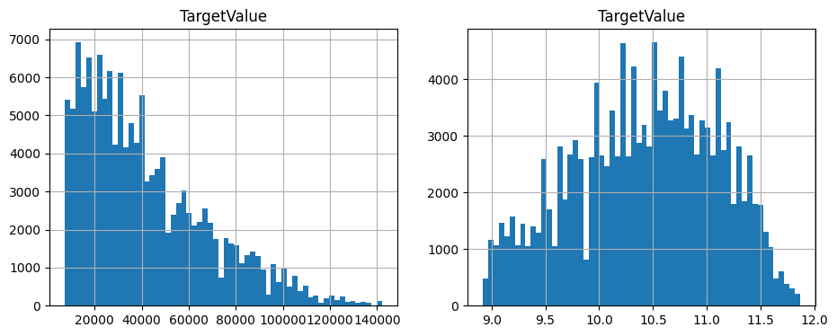
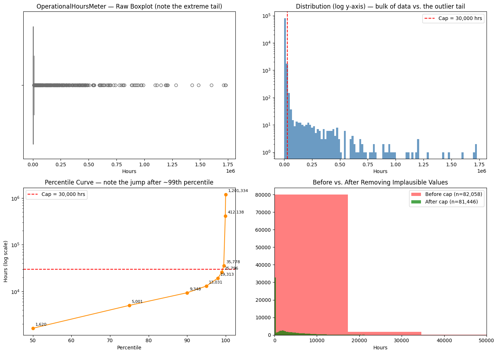

# Heavy Equipment Selling Price Prediction

[](https://github.com/YOUR_USERNAME/heavy-equipment-price-prediction/actions)


A **supervised machine learning** project: predicting the sale price (USD) of heavy industrial machinery from transactional records, technical specifications and usage data. Built for the *Heavy Equipment Selling Price Prediction Challenge* on Kaggle.

The final solution is an **ensemble of gradient-boosted tree models (CatBoost + LightGBM)** trained on `log1p(price)` and validated with a **chronological hold-out** (train on the past, test on the most recent sales).

**Skills demonstrated:** data cleaning and outlier handling, feature engineering, leak-free preprocessing pipelines (scikit-learn), time-aware validation, model comparison, hyperparameter tuning (Optuna), ensembling, and testable, reproducible code.

<!-- Add your Kaggle leaderboard score here, e.g. "Kaggle leaderboard: 0.2xxxx RMSLE (rank N / M)" -->

## Problem

Each row is one finalized sale of a machine, with ~50 columns: system metadata, region, usage (`OperationalHoursMeter`), manufacture year, and a set of high-cardinality technical/specification strings. The task is to predict `TargetValue` (the price). The training data has about 140k rows; the test set has 15,000.

## Approach

| Step | What & why |
|---|---|
| **Data cleaning** | `ManufactureYear` has a sentinel value `1001` in ~10.6% of rows → set to missing. 4 columns are >90% empty → dropped. |
| **Outliers** | `OperationalHoursMeter` is ~41% missing and has an extreme tail (max ≈ 67× the 99th percentile). Values above the training-set 99.5th percentile and exact zeros are treated as meter errors; the rest is log-transformed. The cap is fitted on training data only. |
| **Features** | Asset age at sale (`sale year − manufacture year`), sale year / month / quarter / day-of-week, days elapsed since the first sale. |
| **Validation** | Chronological split: oldest 85% train, newest 15% evaluation. A random split would leak future price levels into training. |
| **Target** | Models are trained on `log1p(TargetValue)` (the target is right-skewed) and scored with **RMSLE**. |
| **Encoding** | One-hot for low-cardinality categoricals, ordinal codes for high-cardinality ones (tree models); CatBoost receives raw categoricals and encodes them natively. |
| **Models** | Linear regression, decision tree, random forest, XGBoost, LightGBM, CatBoost. CatBoost hyperparameters were tuned with Optuna using time-series cross-validation. |
| **Ensemble** | Non-negative blend weights minimising RMSLE. |

### Exploratory highlights

<p align="center">
  
  
</p>

More figures are in [`reports/figures/`](reports/figures) and in the [EDA notebook](notebooks/01_eda.ipynb).

## Results

RMSLE on the chronological evaluation set (lower is better), from the original Kaggle notebook run:

| Model | Eval RMSLE |
|---|---|
| Linear Regression | 0.4287 |
| Decision Tree | 0.3751 |
| Random Forest | 0.2878 |
| XGBoost | 0.2657 |
| LightGBM | 0.2609 |

Final gradient-boosting models and ensemble:

| Model | Eval RMSLE |
|---|---|
| XGBoost | 0.2621 |
| LightGBM | 0.2557 |
| CatBoost | 0.2426 |
| **Blend** (CatBoost 0.71 / LightGBM 0.29 / XGBoost 0) | **0.2401** |

> **Note on the blend score.** In the original run the blend weights were optimised on the same evaluation rows that the score is computed on, so 0.2401 is slightly optimistic. `python -m src.train` now fits the weights on the first half of the evaluation window and reports the blend on the second half (`blend_rmsle_second_half_holdout` in `reports/metrics.json`); that is the number to quote. Numbers from re-running the repo may differ slightly from the table above (see *Reproducing* below).

## Repository structure

```
├── data/                 # place train.csv / test.csv here (not committed) – see data/README.md
├── notebooks/
│   ├── 01_eda.ipynb      # data quality, target, outliers, categorical & regional analysis
│   └── 02_modeling.ipynb # step-by-step modelling walkthrough using src/
├── src/
│   ├── config.py         # paths, column groups, constants
│   ├── data.py           # loading + chronological split
│   ├── features.py       # cleaning and feature engineering
│   ├── preprocess.py     # sklearn preprocessing pipelines
│   ├── models.py         # baseline and final model definitions
│   ├── evaluate.py       # RMSLE and blend-weight fitting
│   ├── train.py          # train, evaluate, save artifacts + metrics
│   └── predict.py        # write Kaggle submission
├── tests/                # unit tests + end-to-end smoke test on synthetic data
├── reports/figures/      # EDA figures
└── submissions/
```

## Reproducing

```bash
git clone https://github.com/YOUR_USERNAME/heavy-equipment-price-prediction.git
cd heavy-equipment-price-prediction
python -m venv .venv && source .venv/bin/activate
pip install -r requirements.txt

# 1. get the data (see data/README.md), then:
python -m src.train   --data-dir data/raw        # add --gpu for CatBoost/XGBoost on GPU
python -m src.predict --data-dir data/raw        # -> submissions/submission.csv

# optional
python -m src.train --data-dir data/raw --fast   # tiny models, just checks the pipeline runs
python -m pytest                                 # tests (no competition data needed)
```

Training writes `models/artifacts.joblib` and `reports/metrics.json`.

*Reproducibility:* seeds are fixed (`random_state=42`). Results can differ slightly from the original notebook because the code was refactored (categorical columns are cast to strings consistently; an inactive `subsample` option on LightGBM was removed), and GPU vs CPU CatBoost is not bit-identical.

## Limitations & next steps

- The final models are trained on the older 85% only; refitting on train + eval before predicting would use the most recent sales.
- LightGBM and XGBoost parameters were chosen by hand; only CatBoost was tuned with Optuna.
- `ProductConfigID` and other high-cardinality columns are ordinal-encoded for LightGBM/XGBoost; target encoding (with out-of-fold fitting) is worth trying.
- The `Spec_FullDescriptor` text column is not used yet; text features (e.g. TF-IDF or embeddings) could add signal.
- Compare against a neural network with categorical embeddings as an additional model family.

## License

MIT — see [LICENSE](LICENSE).
